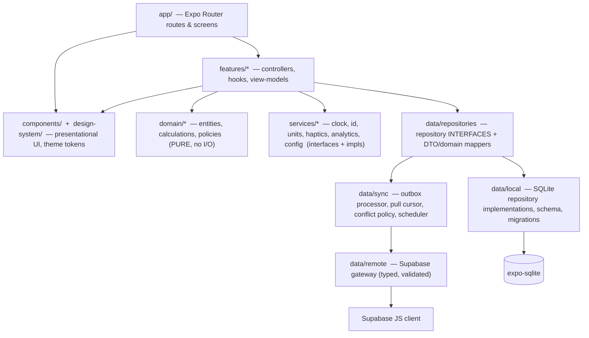
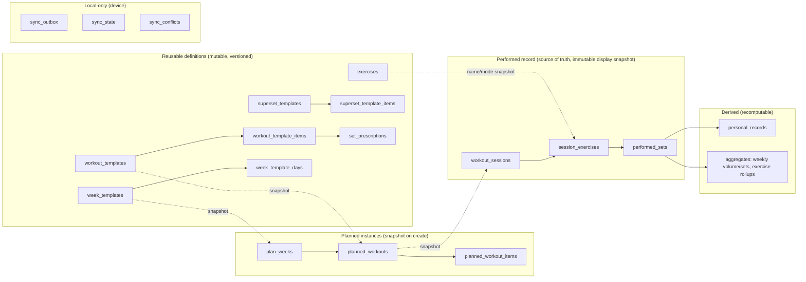

# System Architecture — Weight

## 1. Phase identity

- Lifecycle role: Software architecture (`software-architecture`, phase 4 of 11)
- Execution date: 2026-09-02
- Roadmap state at execution: `IN PROGRESS` → `AWAITING APPROVAL`
- Upstream approvals: `product-strategy` (2026-09-01), `evidence-based-ui-ux` (2026-09-02), `visual-ui-design` (2026-09-02) — all PASS WITH CONDITIONS, conditions accepted as tracked
- Classification: **CREATE** (no prior architecture artifact, no application code, no schema, no ADRs)
- Reported result: `PASS WITH CONDITIONS`
- ADRs: [`docs/architecture/adrs/`](adrs/) — ADR-0001 … ADR-0009

### Revision history

| Rev | Date | Change |
|---|---|---|
| v1 | 2026-09-02 | Initial submission |
| **v2** | 2026-09-02 | **REVISION REQUESTED (sync correctness) — resolved.** Composite pull cursor `(updated_at, id)` with lexicographic continuation (§10.3). Real optimistic concurrency: server-maintained integer `version`, insert-if-absent / update-if-`version = base_version` / atomic increment / conflict-not-overwrite, same rule for tombstones (§8.4, §10.2, ADR-0003). Client-generated `operation_id` per outbox mutation with server-side dedupe; **coalesced latest-state** replay model, one pending outbox entry per `(entity, entity_id)` (§7.2, §8.3, §10.2). Client-clock ordering removed from conflict resolution — winner is decided solely by the `version` protocol; server `updated_at` used only for remote pull ordering, local timestamps only for local display/queue ordering (§10.4, §10.5). Hot-write acknowledgement corrected — visual feedback immediate, SQLite commit targets ≤100 ms perceived persistence, "recorded" is durable only after commit, failure shows "Not saved — retrying" and blocks Finish (§7.2, §11). Terminology: "Foundation increment (SPEC §18 Phase 0)" vs lifecycle phases; typo fixes. |
| **v3** | 2026-09-02 | **REVISION REQUESTED (two remaining races) — resolved.** (a) **In-flight successor acknowledgement** (§7.2, §10.2 step 3): when `O1` completes and a `pending` successor `O2` exists, the client re-bases `O2` to the returned `version`, keeps the row `dirty`, and does **not** apply `O1`'s payload or mark the row synced; an in-flight `conflict` reconciles the latest local payload (`O2`'s if present) against the server row before forming the replacement operation. Invariant relaxed: a `dirty` row has **at least one** outstanding mutation, not exactly one (§8.3). (b) **Pull completeness under late transaction commits** (§10.3): the composite cursor is scoped to the equal-timestamp case only; added **periodic full `(id, version)` reconciliation** (AR-DEC-11) as the completeness guarantee. New: AR-DEC-11, AR-RISK-8, "Sync completeness" quality row; WORK-013 gains a late-commit test and an in-flight-successor test. |
| **v4** | 2026-09-02 | **REVISION REQUESTED (transport-failure state) — resolved.** Renamed the outbox non-`pending` state `in_flight` → **`dispatched`**: a durable, immutable state a request enters *before* it is sent and stays in until a **terminal** result (`applied` / `duplicate` / `conflict`). A transport error / 5xx / timeout / process death is **not** terminal — `O1` stays `dispatched` (bump `attempts`/`next_attempt_at` only) and is retried with the **same `operation_id`**; it never returns to `pending` while a `pending` successor `O2` exists, so `UNIQUE (entity, entity_id) WHERE state = 'pending'` is never violated (§8.3, §10.2 step 3). `dispatched` entries are retried **before** their `pending` successors. Return to `pending` only if provably never sent **and** no successor. A **completed-session** conflict is **parked** in `sync_conflicts` for explicit user choice and is **not** auto-re-issued as a `pending` mutation; its `O2` is dropped (§10.2 step 3, §10.4). WORK-013 gains the lost-transport-response-with-successor case. |

> **Note on "phases".** This document distinguishes **lifecycle phases** (numbered 1–11 in `development-roadmap.md`; this is phase 4) from **delivery increments** (`SPEC.md` §18: "Phase 0 — Foundation" … "Phase 5 — Production hardening"), which are implementation stages owned by `client-engineering` / `backend-data-engineering`. Where this document says "the Foundation increment (SPEC §18 Phase 0)" it means the first delivery increment, not a lifecycle phase.

## 2. Sources inspected

| Source | Use |
|---|---|
| `docs/product/product-strategy.md` (APPROVED) | Requirements FR-*/NFR-*, invariants, priorities, success measures, CON-1…CON-11, DEP-1…5 |
| `docs/product/ux-product-design.md` (APPROVED) | §7.5 route map, §10 state matrix, §10.6 back/recovery requirements, UX-DEC-03/07/08, §16 handoff |
| `docs/design/visual-ui-design.md` (APPROVED) | §10.6 implementation notes, theme-object shape, VIS-DEC-08 (icon dependency), no new behavioural constraints |
| `SPEC.md` §9 (domain model), §9.3 (data rules), §9.4 (constraints/indexes), §10 (technical architecture), §11 (offline/sync), §12 (calculations), §15 (performance/reliability), §16 (analytics/observability), §17 (testing) | `VALIDATE` input — formalized here with reasoning, tradeoffs, and reversibility |
| `development-roadmap.md` | Accepted decisions DEC/UX-DEC/VIS-DEC, constraints, open questions, dependencies, risks |
| `.claude/skills/software-architecture/{SKILL.md,references/phase-contract.md}` + `.claude/skill-system/{lifecycle,decision-ownership,artifact-standard}.md` | Method, ownership boundary, artifact shape |
| Repository tree | Confirmed greenfield: no `src/`, `app/`, `supabase/`, `package.json`, migrations, or tests |

## 3. Execution mode and ownership boundary

**CREATE.** SPEC §10–§17 is treated as a `VALIDATE` input: it prescribes the stack (React Native + Expo + Expo Router + strict TS; `expo-sqlite`; Supabase Auth + Postgres + RLS; layered access; UUIDs; UTC/tz/date-only; forward-only migrations). Those are **accepted constraints** (CON-1…CON-11) and are **not re-litigated here**. This phase owns and adds: module/boundary decomposition and its enforcement, the concrete shape of the layering contract, the sync-engine design, the local persistence and migration strategy, the domain model formalization, the identifier/time strategy, the derived-data recomputation design, quality attributes with measurable architectural implications, technology choices *within* the constrained stack (state management, validation, IDs, testing seams), and requirement→component traceability.

Out of boundary (routed, not decided): product scope; visual design; RLS **policy content** and threat model (→ `security-identity`); Postgres **DDL/migration implementation** and Edge Function code (→ `backend-data-engineering`); navigation/screen implementation (→ `client-engineering`); environments, EAS, OTA (→ `platform-release`); test implementation (→ `quality-engineering`); runtime SLOs/alerts (→ `production-operations`).

## 4. Accepted inputs and consequential assumptions

### 4.1 Accepted inputs

- Local-first: SQLite is the operational store; connectivity is never on the critical path for logging, completion, or recovery (CON-3, FR-SYNC-01, NFR-OFFLINE).
- Every domain mutation is persisted transactionally with an outbox entry (CON-3).
- UI never calls Supabase directly; access flows UI → feature logic → domain services → repository interfaces → local repositories → sync → Supabase gateway (CON-5).
- Supabase for Auth + synchronized Postgres; RLS on every user-owned table, adversarially tested before client exposure; service-role key never shipped (CON-4).
- Client-generated UUIDs; UTC instants + separate session timezone; date-only plan dates (CON-6, SPEC §9.3).
- Forward-only migrations; fresh-create + every upgrade path tested (SPEC §15, CLAUDE.md).
- Expo Go compatibility through prototype/MVP; no custom native modules until an approved dev-build migration; versions via `expo install` and locked (CON-2).
- One active session per user (FR-LOG-12); performed sets are the source of truth; templates/plans snapshot into sessions (invariants).
- Analytics behind an interface; sensitive payloads excluded from telemetry (CON-9).

### 4.2 Consequential assumptions

| ID | Assumption | If wrong |
|---|---|---|
| AR-A1 | Single user per account, one primary device, occasional second device (SPEC single-user MVP). Data volume is small: O(10³) sessions, O(10⁴) performed sets, O(10²) templates over years. | If multi-device concurrent editing is common, the optimistic-concurrency conflict handling (§10.4) is still correct (no lost writes), but the manual `sync_conflicts` review UX needs to harden earlier (roadmap OQ-7). |
| AR-A2 | The full per-user dataset fits comfortably in on-device SQLite and can be fully mirrored (no partial-sync/windowing needed for MVP). | If datasets grow beyond ~tens of MB, introduce a pull window / archival tier. |
| AR-A3 | Supabase PostgREST Data API + RLS is sufficient for all CRUD; Edge Functions are needed only for account deletion cascade/anonymization and any server-secret operation. | If server-side orchestration needs grow, add Edge Functions per case (bounded). |
| AR-A4 | `expo-sqlite` (the SDK-bundled version) supports the transaction + WAL + prepared-statement behaviour the sync engine needs. Verify against the locked Expo SDK before implementation. | If transactional guarantees are weaker than assumed, the outbox atomicity design (AR-DEC-01) needs a compensating check. |
| AR-A5 | A small reactive-query layer over SQLite change events is enough; no need for a heavyweight offline sync framework (WatermelonDB, PowerSync, Replicache) in MVP. | If reactivity/perf is inadequate, adopt one — but several are not Expo Go compatible, which would force the dev-build migration earlier. |

## 5. System context and trust boundaries

```mermaid
flowchart LR
  U[Lifter] --> App

  subgraph Device["Mobile device (iOS / Android) — untrusted for secrets"]
    App["Weight app\n(Expo / React Native)"]
    SQLite[("expo-sqlite\nsystem of record on device")]
    KS[["expo-secure-store\nauth tokens"]]
    App <--> SQLite
    App <--> KS
  end

  subgraph Supabase["Supabase project (trusted server) — authZ = RLS"]
    Auth["Auth (GoTrue)\nemail/password"]
    PG[("Postgres\nsynchronized datastore")]
    REST["Data API (PostgREST)\nRLS-enforced"]
    EF["Edge Functions\n(account deletion, secret ops only)"]
    REST --> PG
    EF --> PG
    Auth -.issues JWT.-> App
  end

  App -- "HTTPS: sign-in / refresh" --> Auth
  App -- "HTTPS: CRUD (JWT), sync push/pull" --> REST
  App -- "HTTPS: delete-account (JWT)" --> EF
  App -- "events (no PII/payloads)" --> An[[Analytics provider\n(interface; provider TBD - DEP-4)]]
```

**External systems:** Supabase Auth, Supabase Data API (PostgREST) over Postgres, Supabase Edge Functions (minimal), an analytics/crash provider (behind an interface, provider deferred — DEP-4), the OS secure keystore, the OS filesystem (SQLite). No other third-party runtime dependencies in MVP. No exercise media/Storage (SPEC §10.3).

**Trust boundaries:**

1. **Device ↔ app data:** the local SQLite file is readable by anyone with device/file access; it holds workout data but **no secrets**. Tokens live only in `expo-secure-store`. On verified sign-out / account deletion the local DB is dropped (AR-DEC-09).
2. **App ↔ network:** all traffic HTTPS. The client authenticates with a short-lived JWT; refresh tokens in secure storage. No personal data in URLs/query strings (product privacy rule).
3. **Client ↔ Supabase:** the client is **untrusted**. Authorization is enforced entirely server-side by **RLS** (`user_id = auth.uid()`), independently for select/insert/update/delete, on every user-owned table and derived view. The client bundles only the publishable/anon key. Policy content and the adversarial test plan are owned by `security-identity`.
4. **Telemetry:** the analytics interface must drop load, body weight, notes, email, and full workout payloads before send (CON-9); enforced at the interface, not per call site.

## 6. Module and component decomposition

### 6.1 Layered dependency rule (ADR-0002)



**Enforced import rules** (via `eslint-plugin-import`/`eslint-plugin-boundaries` or `dependency-cruiser`, wired into CI):

| Layer | May import | May **not** import |
|---|---|---|
| `app/` | `features/*`, `components/`, `design-system/` | `data/*`, `domain/*` directly, `services/*` impls, Supabase client |
| `components/`, `design-system/` | `design-system/` (tokens), React/RN | anything in `features/`, `data/`, `domain/`, Supabase |
| `features/*` | `domain/*`, `services/*` (interfaces), `data/repositories` (interfaces), `components/` | `data/local`, `data/sync`, `data/remote`, Supabase client |
| `domain/*` | other `domain/*`, pure utils | **anything with I/O** — no `data/*`, no `services/*` impls, no RN, no Supabase, no Date.now (use injected clock) |
| `services/*` | platform SDKs behind the interface it defines | `features/*`, `domain/*` policies |
| `data/repositories` | `domain/*` (types), `services/*` interfaces | `data/remote` directly (goes via `data/sync`) |
| `data/local` | `data/repositories` (interfaces), `expo-sqlite`, `domain/*` types | `data/remote`, Supabase client, `features/*` |
| `data/sync` | `data/repositories`, `data/local` (read outbox), `data/remote` | `features/*`, `app/` |
| `data/remote` | Supabase JS client, generated Supabase types, validation schemas | `domain/*` policies, `features/*`, `data/local` |

**Why this rule:** it makes `domain/*` (units, volume/e1RM, PR selection, snapshot logic, week/date boundaries) pure and unit-testable without a device or network; it keeps offline behaviour correct by construction (screens physically cannot await the network); and it isolates the Supabase surface to one directory so an SDK or backend change has a single blast site. Rejected alternatives and reversibility in ADR-0002.

### 6.2 Feature modules

`features/{auth, today, logging, planning, progress, library, settings, sync-status}` — each owns its controllers/hooks and composes `domain` + `services` + `repositories`. `logging` is the highest-risk module and is built and hardened first (aligns with the "prove the vertical slice" guardrail and VIS-DEC "build `SetRow` first").

### 6.3 Domain module (`domain/`)

Pure sub-areas: `entities` (types + invariants), `units` (kg/lb, m, s, plate rounding), `calc` (`setVolume`, `sessionVolume`, `epleyE1RM` with rep-range guard), `pr` (candidate evaluation, tie rules, category set), `snapshot` (template→planned→session copy semantics), `time` (week start, date boundaries, tz-aware "today"), `policy` (one-active-session, deletion-blocks-history, warmups-excluded-from-headline). All functions take inputs explicitly (including an injected `Clock`); no ambient `Date`/`Math.random`.

### 6.4 Services (`services/`)

Interfaces with swappable impls: `Clock`, `IdGenerator` (UUID), `UnitFormatter`, `Haptics`, `Analytics` (no-op default; provider adapter later — DEP-4), `Config`/feature flags, `Connectivity`, `Logger`. Every service is injected (a lightweight container or React context at the app root), so `domain` and `features` are testable with fakes.

## 7. Key runtime and data flows

### 7.1 App boot, auth, first sync

1. App loads theme + fonts (Aeonik if present else fallback — VIS-DEC-07), opens the SQLite DB, runs pending migrations (AR-DEC-06), reads the persisted Supabase session from secure storage.
2. If a session exists → render the app shell from **local data immediately** (no network wait). Kick off a background sync (§10).
3. If no session → auth flow. On sign-in, bind the local DB to `userId` (AR-DEC-09); if a different `userId` than the last local DB, create/switch to that user's DB file.
4. Restore any `active` workout session and its timer anchors before the first frame of the logging surface (UX-DEC-08, FR-SYNC-01).

### 7.2 Log / edit a set (write path — the hot path)

```mermaid
sequenceDiagram
  participant UI as SetRow (features/logging)
  participant SVC as domain (validate, policy)
  participant REPO as PerformedSetRepository (interface)
  participant LOCAL as data/local (SQLite)
  participant OBX as sync_outbox
  UI->>UI: field edit updates the row visually now (component state)
  UI->>SVC: onComplete(setDraft)  (suggested values or edited)
  SVC->>SVC: validate (no negative; zero load ok); apply set-type rules
  SVC->>REPO: upsertPerformedSet(set)   // client UUID already assigned
  REPO->>LOCAL: BEGIN
  LOCAL->>LOCAL: upsert performed_sets row (completed=true, local_updated_at, dirty=1)
  LOCAL->>OBX: upsert the one pending outbox entry for (performed_set, id) — payload=latest, keep operation_id + base_version
  LOCAL->>LOCAL: COMMIT   (target ≤100 ms perceived persistence, SM-4)
  alt COMMIT ok
    REPO-->>UI: committed → row shows "recorded" (durable)
  else COMMIT fails
    REPO-->>UI: error → values stay visible & editable, row shows "Not saved — retrying"; Finish blocked
  end
  Note over OBX: sync scheduler debounced-wakes later (§10)
```

**Acknowledgement semantics (corrected in v2):**

- **Field interaction updates the row visually immediately** from component state — the user never waits on I/O to see what they typed.
- The **SQLite transaction** (write `performed_sets` + upsert the row's one pending outbox entry) targets the accepted **≤100 ms perceived-persistence** budget (SM-4). It is a single local transaction and is **not** gated on the network. No claim is made about a same-frame (≤16 ms) commit — `expo-sqlite` cannot safely guarantee that.
- A set is shown as **durably recorded only after the transaction commits.** In the normal case commit is fast enough to read as instant; a brief pending affordance on the row covers a slow commit.
- **On commit failure:** the entered values remain visible and editable, the row shows **"Not saved — retrying"**, and **Finish is blocked** until the persistence error resolves (this is the active-workout persist-failure state in the UX §10 matrix).
- Editing an already-recorded set is the same path. No confirmation dialog (UX-DEC-07).

**Outbox coalescing (v2):** the outbox holds **at most one `pending` entry per `(entity, entity_id)`** (enforced by a partial-unique index on `state = 'pending'`, §8.3). A further local edit to a row that already has a `pending` (un-pushed or push-failed) entry **updates that entry's `payload` in place**, preserving its `operation_id` and `base_version`. Intermediate states are **not** replayed to the server — every entity is an independently addressable row and only its latest state matters (SPEC §11.2 rule 4). `base_version` is the server `version` the local row was last confirmed at (§8.3, §10.2).

An entry that is already **`dispatched`** is immutable (a `sync_apply` request has been or may have been sent and has no terminal result yet). A concurrent edit while `O1` is `dispatched` therefore creates a **second, `pending` successor `O2`** (new `operation_id`, `base_version` = `O1.base_version`), so a row can have two outstanding entries. `O1` stays `dispatched` and retryable — with the same `operation_id` — across transport/5xx failures and process death; **only** `applied` / `duplicate` / `conflict` terminate it. When `O1` terminates, the client **must not** clear the row or apply `O1`'s returned payload while `O2` exists — it re-bases `O2` to the server `version` `O1` returned (or, for a completed-session conflict, parks it) and keeps the row `dirty` so `O2` is pushed next. Full rules are in §10.2 step 3.

### 7.3 Finish session + derive PRs/aggregates

1. `finishSession(sessionId)` (idempotent) sets status `completed`, `ended_at`, in one transaction with an outbox entry.
2. Synchronously (small data) run `recomputeExercise(exerciseId)` for each exercise in the session and `recomputeWeek(weekStart)` — pure functions over completed `performed_sets` producing `personal_records` and aggregate rows; writes are idempotent (delete-and-reinsert the affected derived rows in the same tx). Each PR row stores `formula_id` + `formula_version` (AR-DEC-05).
3. The finish summary reads the freshly materialized rows. Sync picks up session + derived changes.
4. Editing or deleting a completed session re-runs the same recompute for affected exercises/weeks (FR-DATA-10). Recompute never depends on wall-clock or non-deterministic ordering (`performed_sets` ordered by `(session_exercise_id, position, id)`).

### 7.4 Sync push

Covered in §10 and ADR-0003.

### 7.5 Sync pull + conflict

Covered in §10 and ADR-0003.

### 7.6 Migration on app upgrade

`data/local/migrations/NNNN_*.ts` — ordered, forward-only. On boot the runner compares `user_version`/a `schema_migrations` table to the bundled set and applies missing ones in a transaction each. Fresh-create runs the whole chain. Test matrix: fresh install at HEAD, plus upgrade from every shipped prior version. No down migrations; a bad migration is fixed forward. Postgres migrations are the backend's, kept in lockstep by shared entity definitions (§8).

### 7.7 Active-session recovery

The `active` session, its `session_exercises`, `performed_sets` (including uncompleted drafts), focused-set pointer, and `rest_timer_anchor` (an absolute timestamp) are all normal SQLite rows written transactionally as they change. Relaunch = read them back. No special crash file. "Restore last active session" is a query, not a recovery procedure. If a second device also has an `active` session, the pull step surfaces a **conflict choice** (never auto-merge) — see §10.

## 8. Data architecture

### 8.1 Domain model (formalized from SPEC §9)

Entity groups and the copy/snapshot boundary:



**Rules (ADR-0004, ADR-0005; from SPEC §9.3):**
- All user-owned rows: client-generated UUID PK, `user_id`, `created_at`, `updated_at`, `version` (server-maintained integer, starts at 1), nullable `deleted_at` where soft-delete applies. `updated_at` is **server-generated** (trigger); the client keeps a separate `local_updated_at` for local display/queue ordering only (§10.5).
- **Snapshot, not reference:** `planned_workouts`/`planned_workout_items` copy prescription values and exercise name at creation; `workout_sessions`/`session_exercises` copy again at session start. Completed sessions never JOIN mutable templates for display. Historical exercise/workout **names are denormalized** onto the planned/session rows.
- **Canonical units:** kilograms, meters, seconds at rest. Conversion only in presentation selectors (`domain/units` + `UnitFormatter`).
- **Performed sets** are the source of truth; `personal_records` and aggregates are derived, deterministic, and fully recomputable; a materialized PR stores its `formula_id`/`formula_version`.
- Analytics/history include a `performed_set` only when `completed = true` **and** the parent session is `completed`, unless a specific view states otherwise.
- Numeric validation: no negative load/reps/duration/distance; zero load allowed (bodyweight).

### 8.2 Identifiers and time (ADR-0004)

- **PK:** client-generated UUID for every entity so offline creation never waits for the server. **UUIDv7 preferred** (time-ordered → better B-tree locality on both SQLite and Postgres); UUIDv4 acceptable if a vetted v7 generator isn't available in the locked Expo Go set. Generated by `services/IdGenerator`.
- **Instants:** stored UTC (epoch-ms integer in SQLite; `timestamptz` in Postgres). **Session timezone** stored separately as an IANA string (`workout_sessions.timezone`).
- **Plan dates:** date-only `TEXT` `YYYY-MM-DD` (SQLite) / `date` (Postgres). "Today" and week boundaries are computed in the user's current timezone by `domain/time` using the injected `Clock`.
- **Rest timer:** persisted as an absolute `rest_timer_anchor` timestamp, never a decrementing counter.

### 8.3 Local persistence strategy (ADR-0006)

- **Schema = a mirror** of the Postgres schema (same snake_case names), including the server-authoritative `version` column on every synced row, **plus three local-only tables:**
  - `sync_outbox` — outstanding mutations. Columns: `seq` INTEGER autoincrement (local queue order), **`operation_id`** TEXT UUID **UNIQUE** (client-generated, stable for the life of the entry, sent to and recognised by the server), `entity`, `entity_id`, `op` (`upsert` | `delete`), `payload_json` (latest local state), **`base_version`** INTEGER (the server `version` the local row was last confirmed at — captured when the first unsynced edit was made, preserved across coalescing), **`state`** (`pending` | `dispatched`), `attempts`, `next_attempt_at`, `last_error`.
    - **`pending`** — not yet sent; mutable (coalescing updates its payload in place). **Partial-unique index `(entity, entity_id) WHERE state = 'pending'`** → at most one `pending` entry per row (§7.2).
    - **`dispatched`** — a `sync_apply` request has been (or may have been) sent and no **terminal** result (`applied` / `duplicate` / `conflict`) has been recorded yet. **Immutable and durable**: it survives transport/5xx failures (they only bump `attempts` / `next_attempt_at`) and process death; it is retried with the **same `operation_id`** until it terminates. It is **not** covered by the partial-unique index, so a `dispatched` `O1` may legally coexist with a `pending` successor `O2`.
  - `sync_state` — per entity: **composite pull cursor `(last_pulled_updated_at, last_pulled_id)`**, plus a `last_full_sync` marker (drives §10.3.2).
  - `sync_conflicts` — preserved losing/stale copies for user review: `entity`, `entity_id`, `local_payload`, `server_payload`, `local_base_version`, `server_version`, `detected_at`, `resolved_at`.
- Each synced local row also carries `synced_version` (= server `version` last applied) and a `dirty` flag. **Invariant:** a `dirty` row has **at least one outstanding mutation** — one `dispatched` op, one `pending` op, or one of each during a concurrent edit (a `dispatched` predecessor `O1` and its `pending` successor `O2`, §7.2, §10.2). A row is cleared (`dirty = 0`, `synced_version` advanced) only when it has **no** outstanding outbox entry.
- WAL mode; foreign keys ON; prepared statements; all multi-row domain writes in a transaction with their outbox upsert.
- **Indexes (from SPEC §9.4):** `plan_weeks(user_id, week_start_date)` unique; partial-unique one `active` session per user; `workout_sessions(user_id, started_at desc)` and `(user_id, status)`; `performed_sets(session_exercise_id, position)`; `planned_workouts(user_id, scheduled_date)`; local normalized-name index for exercise/template search (`lower(name)` / trigram-equivalent) to hit SM-7 (<300 ms local search).
- **FK delete behaviour:** RESTRICT for anything referenced by history; CASCADE only for uncommitted child structures (e.g. deleting a draft session cascades its draft sets). Deletion that would break history is blocked at the repository/domain layer and the user is offered archive/soft-delete (FR-LIB-08).

### 8.4 Server schema ownership and the concurrency protocol

`backend-data-engineering` owns the Postgres DDL and migrations. This phase fixes the **entity shape, keys, FKs, constraints, and indexes** above as the contract, plus: forward-only migrations; `updated_at` **server-generated by trigger** on every insert/update; `version` **server-maintained**; a server-side `recompute` implementation matching `domain/calc` + `domain/pr` semantics (same `formula_id`/`formula_version`); RLS on every user-owned table and any derived view. Types are generated from migrations into `data/remote` only.

**Optimistic-concurrency invariant (v2 — the mechanism is the backend's choice; the invariant is not negotiable):**

For every synced user-owned entity:

1. **Insert** is accepted only when the row does **not** already exist. The new row is created with `version = 1`.
2. **Update** is accepted only when the submitted `base_version` **equals the current row `version`**.
3. An accepted update (or accepted tombstone) **atomically increments `version`** (`version = base_version + 1`) and sets a fresh server `updated_at`.
4. **Delete / tombstone** follows the same rule: `deleted_at` is set only when `base_version = version`; on acceptance `version` is incremented.
5. A **`base_version` mismatch returns a conflict result** (the current server row + its `version`); the server **never overwrites** a newer value.
6. Every request carries the client `operation_id`. The server keeps a **`processed_operations`** record (`operation_id`, `result`, `resulting_version`, `at`); a repeat of a known `operation_id` returns the **stored result** without re-applying — this makes lost-ack retries and offline-then-online replays exactly-once, and prevents a retried insert (PK already present, same `operation_id`) from being read as a conflict.
7. A PK collision with a **different** `operation_id` is a genuine conflict (independent creation of the same id) and is surfaced, not merged.

**Recommended mechanism:** a single narrowly-scoped `rpc` function `sync_apply(operation_id, entity, entity_id, op, payload, base_version) → {status: applied | duplicate | conflict, version, row}` that performs the dedupe check, the version check, the write, and the increment **atomically** in one round trip, running `SECURITY INVOKER` so RLS still applies. The alternative — conditional PostgREST requests (`PATCH …?id=eq.<id>&version=eq.<base_version>` with `Prefer: return=representation`; zero rows affected ⇒ conflict) plus a separate `processed_operations` upsert — is acceptable but needs two statements and its own dedupe path. Final choice is AR-OQ-6; the invariant above holds either way.

## 9. API and integration contracts

| Contract | Transport | Owner | Notes |
|---|---|---|---|
| Auth (sign-up, sign-in, refresh, reset, sign-out) | Supabase Auth SDK, wrapped by `services/AuthProvider` | `security-identity` (policy), architecture (seam) | Tokens → `expo-secure-store`. `AuthProvider` exposes `userId`, session, and lifecycle events. |
| CRUD for every synced entity | Supabase Data API (PostgREST), **only** via `data/remote` gateway | architecture (gateway shape), `backend-data-engineering` (schema), `security-identity` (RLS) | Gateway methods are per-entity, typed, and **validate every response row** (ADR-0008). No ad-hoc queries outside the gateway. |
| Sync push | Per-entity `sync_apply(operation_id, entity, id, op, payload, base_version)` calls (or conditional PATCH + dedupe — AR-OQ-6), dependency-ordered from the outbox | architecture (`data/sync`), `backend-data-engineering` (function) | Exactly-once via `operation_id` dedupe; optimistic concurrency via `version` (§8.4, §10.2). Never a blind upsert. |
| Sync pull — incremental | Per entity: `where (updated_at, id) > (last_pulled_updated_at, last_pulled_id)` — i.e. `updated_at > :u OR (updated_at = :u AND id > :i)` — `order by updated_at, id limit N`, paged to drain | architecture (`data/sync`) | Composite cursor prevents same-timestamp page-boundary skips (§10.3.1). Tombstones via `deleted_at`. Latency path only — not the completeness guarantee. |
| Sync pull — full reconciliation | Per entity: `select id, version, deleted_at from <entity> order by id` (light projection), then fetch full rows only for discrepancies | architecture (`data/sync`) | Runs on cold start / stale foreground / manual sync (§10.3.2). RLS-scoped like any read. Covers rows a late transaction commit left behind the incremental cursor. |
| Account deletion | Supabase Edge Function (`delete-account`) — re-auth required, server-side cascade/anonymize, returns a receipt | `backend-data-engineering` + `security-identity` | The only Edge Function required for MVP (plus any future secret op). Behaviour choice is roadmap OQ-10. |
| Analytics events | `services/Analytics` interface; no-op default | architecture (interface), `production-operations` (provider) | Interface strips load/bodyweight/notes/email/payloads before dispatch (CON-9). Provider deferred (DEP-4). |
| RLS | Postgres policies | `security-identity` | Treated by the client as the authoritative authorization boundary; client never assumes it can see only its own rows without RLS. |

No GraphQL, no custom REST server, no message broker, no realtime subscriptions in MVP (ADR-0003).

## 10. Sync and consistency model (ADR-0003)

**Design:** transactional **outbox** (push) with **`operation_id` exactly-once dedupe**, a **durable immutable `dispatched` state** (only a terminal result removes an entry) that may carry a **`pending` successor**, and **server-`version` optimistic concurrency** + a two-part **pull** (a **composite `(updated_at, id)` incremental cursor** for latency plus a **periodic full `(id, version)` reconciliation** for completeness — the incremental feed alone cannot see a late transaction commit) + **tombstones** + **stale-write rejection with a preserved `sync_conflicts` copy**. The winner of a concurrent change is decided **only** by the server `version` protocol — never by comparing device clocks.

### 10.1 Triggers
Sync runs after: authentication, app foreground, connectivity restoration, manual retry, and debounced local change (SPEC §11.1). A single-flight scheduler prevents overlapping runs.

### 10.2 Push

**A dispatched operation is immutable until a terminal protocol result.** Only `applied`, `duplicate`, or `conflict` may terminate (delete) an outbox entry. A transport error, a 5xx, a timeout, or process death is **not** terminal — the entry stays `dispatched` and is retried with the **same `operation_id`**.

1. **Select** due entries — `state = 'dispatched'` with `next_attempt_at ≤ now` **first**, then `state = 'pending'`. Within that, order by dependency tier so parents precede children (`exercises` → `*_templates` → `*_template_items` → `plan_weeks` → `planned_workouts` → `planned_workout_items` → `workout_sessions` → `session_exercises` → `performed_sets` → derived), then by `seq`. A `dispatched` predecessor is always retried before its `pending` successor. (`personal_records` and aggregates are **push-optional**: the server recomputes authoritatively.)
2. **Dispatch** — set the entry to `dispatched` (a no-op if already `dispatched`), then call `sync_apply(operation_id, entity, entity_id, op, payload, base_version)` (§8.4). The stable `operation_id` + coalesced-latest-state payload make a retry after a lost acknowledgement exactly-once (the server returns the stored result).
3. **Terminal acknowledgement** — one local transaction, successor-aware. Let `O1` be the entry, `V` the returned `version` (or stored `resulting_version` for `duplicate`), `O2` the `pending` successor for the same `(entity, entity_id)` if a concurrent edit created one while `O1` was `dispatched` (§7.2).
   - **`applied` / `duplicate`:**
     - delete `O1`;
     - **if `O2` exists:** set `O2.base_version = V`; keep `O2.operation_id` and payload unchanged; **keep the local row `dirty = true`**; **do not** write `O1`'s returned payload over the local row (already stale vs `O2`). `O2` is pushed next pass.
     - **else:** set `synced_version = V`, clear `dirty`.
   - **`conflict`** (server row at `version` `Vs` > `O1.base_version`): do **not** overwrite anything. Delete `O1`. Write the rejected local payload — `O2`'s if present, else `O1`'s — + `{local_base_version, server_version: Vs}` to `sync_conflicts`; emit conflict telemetry. Then, **by entity class (§10.4):**
     - **Completed-session data** (`workout_sessions.status = completed` and children, `personal_records`): **park it.** Drop `O2` if present (its content is already captured in `sync_conflicts`); apply the server row as the new base (`synced_version = Vs`); the row is **not** `dirty` and **no** new pending mutation is created. The parked `sync_conflicts` entry awaits an explicit user choice, which — and only which — may later create a fresh mutation.
     - **Non-completed data** (drafts, plans, library items, in-progress session rows): auto-reconcile — if the reconciled local change is still meaningful, ensure **exactly one `pending` entry** carries it (**re-base `O2`** to `Vs` with the reconciled payload, or create one new `pending` entry if `O2` is absent) and keep the row `dirty`; if it is no longer meaningful, drop `O2`, apply the server row, set `synced_version = Vs`, clear `dirty`.
   - **Non-terminal (transport error / 5xx / timeout):** `O1` **stays `dispatched`** with its `operation_id`, `payload`, and `base_version` **unchanged**; increment `attempts`; set `next_attempt_at` with exponential backoff + jitter; record `last_error`. `O2`, if present, stays `pending` behind it — **no second `pending` row is created, so the partial-unique index is never violated.** Entries are retained until they terminate or the user explicitly discards them (no silent drop — FR-SYNC-04).
   - **Return to `pending`** is allowed **only** when the client can prove the request was **never dispatched** (e.g. a synchronous failure before the HTTP send — connectivity check failed, or the fetch threw before opening the socket) **and** there is no successor `O2`. Otherwise the entry remains `dispatched` and relies on `operation_id` dedupe (a retry that the server already applied returns `duplicate`, which then re-bases `O2` — see WORK-013).
4. **Process-death recovery:** on the next sync pass, `dispatched` entries are simply due entries — they are retried with their original `operation_id`. No special recovery path.
5. Push and pull run in one sync pass; a `conflict` on push is resolved before or together with the corresponding pull row.

### 10.3 Pull

Pull has **two mechanisms**: an incremental composite-cursor feed for the common case, and a periodic full version reconciliation that is the actual completeness guarantee. The incremental feed alone is **not** sufficient — see 10.3.2.

#### 10.3.1 Incremental pull (composite `(updated_at, id)` cursor)
Per entity, page with deterministic ordering:
```sql
SELECT * FROM <entity>
WHERE updated_at > :last_pulled_updated_at
   OR (updated_at = :last_pulled_updated_at AND id > :last_pulled_id)
ORDER BY updated_at, id
LIMIT :N;
```
After applying a page, advance the cursor to the `(updated_at, id)` of the **last row applied** (not to `max(updated_at)`), repeating until a page returns fewer than `N` rows. This makes the cursor a total lexicographic position, so it **cannot skip a row that was already committed and visible when its `(updated_at, id)` position was passed** — it fixes the equal-timestamp page-boundary case.

**It does not cover a late transaction commit.** `updated_at` is assigned inside a transaction but the row only becomes visible at commit, and commit order is not `updated_at` order:

1. Tx A writes a row with `updated_at = t1` but has not committed.
2. Tx B writes `updated_at = t2` (`t2 > t1`), commits, and is pulled.
3. The cursor advances past `(t2, …)`.
4. Tx A commits. Its row at `t1` is now **behind the cursor** and the incremental feed will never return it.

#### 10.3.2 Full version reconciliation (covers late commits) — AR-DEC-11
The `sync_state.last_full_sync` marker drives a periodic pass that does not depend on `updated_at` ordering:

- **When:** on authenticated cold start, and at foreground when `last_full_sync` is older than a configurable interval (`Config.fullReconcileIntervalHours`, default 24h), and on manual "sync now".
- **How:** for each entity, page through **`(id, version, deleted_at)` only** (a light projection — for the assumed dataset, AR-A2, this is a few hundred KB per entity), ordered by `id`. Compare each server tuple to the local row:
  - server `id` absent locally, or server `version` > local `synced_version`, and the local row is **not `dirty`** → fetch the full row and apply it (§10.3.3).
  - server `version` > local `synced_version` and the local row **is `dirty`** → treat as a **conflict** (§10.4) — the incremental feed missed it or a late commit occurred; the local edit is preserved before the server row is applied.
  - server `deleted_at` set and not yet tombstoned locally → apply the tombstone.
  - local `id` **absent from the server set** and the row is **not `dirty`** and has **no outstanding outbox entry** → an anomaly (should not happen with client-generated UUIDs + soft-delete); flag via telemetry, do **not** delete it.
- On completion, set `last_full_sync = now`. Leave the incremental cursor **unchanged unless** a run of incremental pull has since advanced past it — never move it backward (a recovered late-commit row can have an `(updated_at, id)` *below* the current cursor; that is expected and fine, since completeness now rests on reconciliation, not the cursor).

This makes the completeness guarantee: **every server change is observed within one `fullReconcileIntervalHours` window even if it committed out of `updated_at` order.** The incremental feed keeps latency low between reconciliations.

#### 10.3.3 Applying a pulled row
For each incoming row, in `(updated_at, id)` order for the incremental feed (any order for reconciliation, since it is keyed by `id` + `version`):
- local row **not `dirty`** → overwrite with the server row; set `synced_version` = server `version`.
- local row **`dirty`** and server `version` ≠ local `synced_version` → **conflict**: preserve the local payload in `sync_conflicts` (§10.4) before overwriting; the local edit is never silently lost.
- `deleted_at != null` → apply as a local **tombstone** (soft-delete); never a hard delete of a row the user may still be viewing.
- Derived rows (`personal_records`, aggregates): apply the **server's** recomputed values as authoritative; the client's local recompute must converge (AR-DEC-05).

### 10.4 Conflict resolution — decided by `version`, not by clock
- **Stale write (push `conflict`, or a `dirty` local row overtaken on pull):** the submitted `base_version` is behind the server `version`. The rule is *the last write **accepted by the version protocol** wins* — a client can never win by having a larger device timestamp. The rejected local change is preserved in `sync_conflicts` (entity, local payload, server payload, `local_base_version`, `server_version`). Conflict **telemetry** is emitted (sanitized). Then:
  - **Non-completed data** (drafts, plans, library items, in-progress session rows): auto-reconcile by taking the server row as the new base and, if the local change is still meaningful, re-applying it as a fresh mutation on top (new `operation_id`, `base_version` = the new server `version`). If it is no longer meaningful, drop it. The `sync_conflicts` copy remains for audit.
  - **Completed-session data** (`workout_sessions` with `status = completed` and their `session_exercises` / `performed_sets`, and any `personal_records`): **never auto-overwritten and never automatically re-issued as a `pending` mutation.** The local edit is **parked** in `sync_conflicts` as a recoverable copy; any `pending` successor (`O2`) for that row is dropped (its content is in the parked copy); the server row is applied as the new base. The parked conflict is surfaced to the user, and only their **explicit choice** can create a fresh mutation to re-apply the local change (FR-SYNC-04, SPEC §11.2 rule 6).
- **Tombstone vs unsynced local edit:** a remote `deleted_at` for a row with an unsynced local edit follows the same rule — the local edit is preserved in `sync_conflicts` and (for completed-session data) surfaced before the tombstone is applied. A remote tombstone never erases an unsynced local edit without a recoverable copy.
- **Two active sessions** (this device and another both `status = active`): detected on pull; raises a **conflict choice** in the UI (resume mine / take theirs / keep both as one active + one draft). Never auto-merged (FR-SYNC-05, SPEC §11.3). Exact copy/options are UX-OQ-6.

### 10.5 Determinism, ordering & idempotency (architectural invariants for downstream)
- `finishSession`, outbox push (`sync_apply`), pull-apply, and `recompute*` are all **idempotent** and safe to re-run after a crash mid-operation. `operation_id` dedupe makes push exactly-once even across process death.
- Recompute output is a pure function of the ordered set of completed `performed_sets` (+ `formula_version`); no wall-clock, no map iteration order. Ordering key: `(session_exercise_id, position, id)`.
- **Outbox push order** is total by dependency tier then `seq`. **Incremental pull apply order** is total by `(updated_at, id)`; **reconciliation** apply order is by `id` (keyed by `id` + `version`, order-independent).
- **Pull completeness** is guaranteed by the periodic full `(id, version)` reconciliation (§10.3.2), **not** by the incremental cursor: `updated_at` is set inside a transaction but a row is only visible at commit, and commit order ≠ `updated_at` order, so a late commit can land behind the cursor. Reconciliation catches every such row within one `fullReconcileIntervalHours` window.
- A dispatched operation is **immutable until a terminal result** (`applied` / `duplicate` / `conflict`); transport failure, 5xx, timeout, and process death keep it `dispatched` and retryable with the same `operation_id`. It returns to `pending` only if provably never sent and with no successor (§10.2 step 3). This keeps the "at most one `pending` per `(entity, entity_id)`" index invariant true at all times.
- A row is only marked clean (`dirty = 0`, `synced_version` advanced) when it has **no** outstanding outbox entry — a `dispatched` op with a `pending` successor keeps the row dirty (§8.3, §10.2 step 3).
- **Timestamp roles are separated:**
  - server `version` — the **only** input to concurrency/conflict decisions;
  - server-generated `updated_at` — **only** for the incremental pull cursor;
  - client `local_updated_at` / outbox `seq` — **only** for local display ordering and local queue order; never compared against a server timestamp to choose a winner.
- Clock skew between the device and the server therefore cannot select the wrong winner, and cannot cause a row to be permanently skipped (reconciliation is `updated_at`-independent).

### 10.6 Explicitly deferred
CRDTs; third-party replication engines (WatermelonDB sync, PowerSync, Replicache, ElectricSQL); Supabase Realtime subscriptions; field-level merge. Rationale and re-entry conditions in ADR-0003.

## 11. Quality attributes (measurable architectural implications)

| Attribute | Requirement | Architectural implication | Verification path (routed) |
|---|---|---|---|
| **Offline availability** | Logging, completion, active-session recovery never depend on the network (NFR-OFFLINE) | Layering rule makes screens unable to await the network; SQLite is the read/write source; sync is a background concern | Airplane-mode E2E (scenario 2); lint boundary check → `quality-engineering` |
| **Write latency** | Field edit is visible immediately (component state); the SQLite transaction targets ≤100 ms perceived persistence (SM-4); "recorded" is shown only after commit; on failure the row stays editable with "Not saved — retrying" and Finish is blocked | Single local transaction per set (row + one coalesced outbox upsert); no cross-process/IPC; no network on path; prepared statements. No same-frame (≤16 ms) commit is promised — `expo-sqlite` cannot guarantee it. | Instrumented write timing on device; failure-path E2E → `quality-engineering` |
| **Recovery** | No confirmed set lost after force-close (SM-5) | Every confirmed set + session pointer + timer anchor are committed rows; restore = query | Force-close/relaunch E2E → `quality-engineering` |
| **Data integrity / idempotency** | Deterministic, idempotent finish/replay/recompute (NFR-DATA-INTEGRITY, FR-DATA-10) | Pure `domain/calc`+`pr`; delete-and-reinsert derived rows in-tx; total apply orders; `formula_version` stamped | Property/unit tests on `domain/*`; duplicate-sync tests → `quality-engineering` |
| **Sync completeness** | No server change is permanently missed, incl. under out-of-order transaction commits and multi-edit offline queues (FR-SYNC-03/04) | Incremental composite cursor for latency + periodic full `(id, version)` reconciliation for completeness (§10.3.2, AR-DEC-11); successor-aware push acknowledgement (§10.2 step 3) | Late-commit reconciliation test + in-flight-successor test in the sync conformance suite (WORK-013) → `quality-engineering` |
| **Migration safety** | Forward-only; fresh + every upgrade path tested | Numbered migration runner; `schema_migrations` table; no down migrations; client/server lockstep via shared entity defs | Migration matrix tests → `backend-data-engineering` + `quality-engineering` |
| **Security posture** | Cross-account isolation; no privileged key in client (NFR-SEC) | Authorization = RLS only; single `data/remote` gateway; anon key only; tokens in secure store; per-user local DB | Adversarial two-user RLS tests → `security-identity` + `quality-engineering` |
| **Portability** | Expo Go now → dev build before production (NFR-PORTABILITY, CON-2) | No custom native modules; all native capability behind `services/*` interfaces; sync engine is pure TS + `expo-sqlite`; icon/font families version-locked | Expo Go compatibility check in CI → `platform-release` |
| **Performance (lists/search)** | Virtualized long lists; indexed local search; no full-catalog fetch per keystroke (SPEC §15) | `FlatList`/`FlashList`-style virtualization in `components/`; local name index; debounced query in `features/library` | Perf checks on large fixtures → `quality-engineering` |
| **Reliability isolation** | Failures in analytics/sync never crash the active workout (NFR-RELIABILITY) | `Analytics`/`sync` run outside the render path; errors caught at the service boundary; logging path has no `throw` to UI | Fault-injection tests → `quality-engineering` |
| **Testability** | Focused tests at the narrowest reliable layer (CLAUDE.md) | Pure `domain/*`; injected `services/*`; repository interfaces with in-memory fakes; sync engine testable against a fake gateway + real SQLite | Test-layer map → `quality-engineering` |
| **Accessibility/i18n** | Unit/locale conversion only at presentation (NFR-A11Y/INTL) | Canonical kg/m/s at rest; `domain/units` + `UnitFormatter` at the edge; no locale logic in `data/*` | → `client-engineering`, `quality-engineering` |

## 12. Technology decisions

### 12.1 Accepted as constraint (not decided here)

React Native + Expo + Expo Router + strict TypeScript (CON-1); Expo Go compatibility, `expo install`-locked versions, no custom native modules pre-dev-build (CON-2); `expo-sqlite` as the local operational DB (CON-3); Supabase Auth + Postgres + RLS, no service-role key in client (CON-4); layered access (CON-5); UTC + tz + date-only (CON-6); analytics behind an interface (CON-9); `expo-secure-store` for tokens (SPEC §6.1); `expo-font` for Aeonik (VIS-DEC-07).

### 12.2 Chosen here (within the constrained stack)

| Decision | Choice | Rejected | Reversibility |
|---|---|---|---|
| Client/domain state (ADR-0007) | React state + Context for UI; **one small store (Zustand)** for cross-screen ephemeral session UI; **domain data only in SQLite**, read via a thin reactive query hook over SQLite change events | Redux/RTK (ceremony, tempts putting domain data in the store); MobX; TanStack Query **against Supabase** (bypasses the layer) | High — the store holds only ephemeral UI; swapping it touches no domain/data code |
| Server data access (ADR-0007) | Repository interfaces + SQLite impls + a `data/sync` engine + a single typed `data/remote` gateway | Direct `supabase-js` calls from hooks; a generic "offline query" lib | Medium — gateway is one directory; a replication lib could later sit behind `data/sync` |
| Boundary validation (ADR-0008) | A schema lib (**Zod** or valibot — final pick a bundle-size call for `client-engineering`) at the gateway and repository inputs; hand-authored `domain/` types; generated Supabase types confined to `data/remote` | Trusting PostgREST responses; `io-ts`; class-validator | High — validation is additive at two seams |
| Identifiers (ADR-0004) | Client UUIDv7 (v4 fallback) via `services/IdGenerator` | Server-assigned IDs (breaks offline create); ULID (less ecosystem support in RN) | High — generator is one service; PK format change is a migration |
| Derived data (ADR-0005) | Deterministic pure recompute, materialized locally, idempotent, `formula_version`-stamped; server mirrors in SQL | On-the-fly computation every read (slow for history/trends); event-sourcing | Medium — materialization can be dropped for computed views if perf allows |
| Migrations (ADR-0006) | Numbered forward-only TS migrations + runner + `schema_migrations`; client/server lockstep via shared entity definitions | ORM auto-migrate; down migrations; ad-hoc `CREATE TABLE IF NOT EXISTS` | Low for existing rows (forward-only by policy); the mechanism itself is replaceable |
| Reactive reads | Lightweight `useDbQuery` over `expo-sqlite` change notifications / manual invalidation | WatermelonDB/PowerSync (not all Expo Go compatible — would force early dev-build); `@tanstack/db` | Medium — hook API is small; a lib can back it later at the cost of the Expo Go boundary |
| Icon & font families | Version-locked outlined icon set from the Expo stack (VIS-DEC-08); Aeonik via `expo-font` with fallback (VIS-DEC-07) | SF Symbols (not cross-platform); synthesized weights | High — behind `components/` + theme |
| Testing seams | Pure `domain/*`; in-memory repository fakes; fake `data/remote` gateway + real SQLite for sync tests; component tests via RN Testing Library; E2E via Maestro/Detox (tool choice → `quality-engineering`) | Only E2E; only unit | High |

### 12.3 Notable rejected architectural options

- **A dedicated backend service / BFF** between the app and Postgres — rejected: RLS + PostgREST covers MVP CRUD (AR-A3); a BFF adds an ops surface and a second deploy target with no evidenced need.
- **Event-sourced session log as the source of truth** — rejected: `performed_sets` rows already are the source of truth; event sourcing adds projection complexity for a single-user, low-volume domain.
- **Full replication framework in MVP** — rejected: Expo Go compatibility (CON-2) and complexity; the outbox+watermark design is enough for AR-A1/A2 and is a known, debuggable pattern.
- **Realtime subscriptions** — rejected for MVP: pull-on-trigger meets the "sync across sessions/devices with visible recovery" requirement; realtime adds connection management and is a post-MVP enhancement.

## 13. Deployment topology assumptions (no ownership taken)

For `platform-release` to decide and own: one Supabase project per environment (at least `dev` and `prod`; a shared `local` stack for development per Supabase guidance); the client ships the publishable/anon key per environment via build-time config (`app.config` + EAS env), **never** a service-role key; Edge Functions deployed with the project; EAS Build/Submit and OTA (`expo-updates`) introduced at the Expo-Go→dev-build migration (the Production-hardening increment, SPEC §18 Phase 5). Migrations applied to remote environments through the backend's migration tooling, gated in CI. This section records assumptions only; the topology decision is out of this phase's boundary.

## 14. Cross-cutting concerns

| Concern | Approach |
|---|---|
| Error handling | `domain/*` returns typed results or throws domain errors; `features/*` map to UI states from the UX §10 matrix; `data/*` wrap infra errors; the **logging path never propagates a throw to the UI** (NFR-RELIABILITY). |
| Logging / telemetry | `services/Logger` + `services/Analytics` interfaces; sanitization in the interface (CON-9); operational signals (migration failure, active-session restore failure, outbox depth/oldest age, `last_full_sync` age, sync retry count and terminal errors, `sync_conflicts` rate, reconciliation-detected discrepancy count, RLS/authz failures) emitted as structured events for `production-operations` (SPEC §16.2). |
| Config / feature flags | `services/Config` — build-time env + a small runtime flag map (e.g. `guestModeEnabled=false`, `darkModeLaunch=?`, `fullReconcileIntervalHours=24` — §10.3.2), so deferred/tunable decisions (OQ-3, OQ-8) are flags, not rewrites. |
| Units / i18n boundary | Canonical kg/m/s in `domain`/`data`; conversion + locale formatting only in presentation selectors; first-day-of-week and date formatting in `domain/time` + formatters. |
| Secret handling | Only the anon key in the bundle; tokens in `expo-secure-store`; no secret in source, logs, or artifacts (CLAUDE.md). |
| Idempotency keys | The client-generated **`operation_id`** (one per outbox entry, stable across retries and coalescing) is the sync idempotency key; the server dedupes on it via `processed_operations` (§8.4). `finishSession` is keyed by `sessionId` + a terminal-state check. Entity UUID + `op` + `base_version` is **not** used as an idempotency key (it is not unique across multiple offline edits). |

## 15. Downstream routing

| Phase | Owns / must decide | Given by this phase |
|---|---|---|
| `security-identity` | RLS policy content for every table + derived view (select/insert/update/delete separately); threat model; adversarial RLS test plan; token storage review; account-deletion server behaviour (OQ-10); guest-mode security if adopted (OQ-3) | Trust boundaries (§5), the RLS-as-authorization decision (ADR-0009), the entity list, the gateway surface |
| `backend-data-engineering` | Postgres DDL + forward-only migrations; `updated_at` triggers; server-side `recompute` (SQL/Edge) matching `domain` semantics + `formula_version`; the `delete-account` Edge Function; generated types | Entity shape/keys/FKs/constraints/indexes (§8), determinism/idempotency invariants (§10.5), API contract table (§9) |
| `client-engineering` | Implement the layers, navigation (UX route map), state (`ADR-0007`), `SetRow` + logging slice first, reactive `useDbQuery`, validation lib pick, virtualization lib, icon/font wiring | §6 decomposition + import rules, §7 flows, §10 sync engine, §11 quality implications, theme-object from visual |
| `platform-release` | Environments, EAS Build/Submit, OTA, Expo Go→dev-build migration, per-env key injection, migration CI gate | §13 assumptions, CON-2 boundary, version-lock requirements |
| `quality-engineering` | Test strategy per §11 verification paths; the §17 SPEC test matrix; boundary-lint gate; migration matrix; adversarial RLS; offline/recovery/idempotency E2E | §11 attribute→implication→verification table, determinism invariants, test seams (§12.2) |
| `production-operations` | SLOs/alerts/runbooks for the §14 operational signals; outbox-depth and sync-failure monitoring; migration-failure response | Operational signal list (§14), sync failure modes (§10) |

## 16. Requirement → component traceability

| Requirement (product-strategy) | Architecture element |
|---|---|
| FR-LOG-01…14, UX-DEC-03 | `features/logging`, `domain/{entities,calc,policy}`, `PerformedSet/Session` repositories, §7.2 write path |
| FR-SYNC-01…05, NFR-OFFLINE | Layering rule (§6.1), `data/sync` (§10, ADR-0003), `sync_outbox`/`sync_state`/`sync_conflicts` (§8.3) |
| FR-PLAN-09, FR-LIB-06, FR-DATA-03 (snapshot-not-reference) | `domain/snapshot`, denormalized name columns, planned/session copy in §8.1 |
| FR-DATA-04…10, §12 calculations | `domain/{calc,pr}`, `recomputeExercise/Week` (§7.3, ADR-0005), `personal_records`/aggregates with `formula_version` |
| FR-LOG-12 (one active session) | Partial-unique index (§8.3) + `domain/policy` + §10.4 two-active-session conflict |
| FR-AUTH-01…05, NFR-SEC | `services/AuthProvider`, `data/remote` gateway, RLS-as-authorization (ADR-0009), per-user local DB, `expo-secure-store` |
| FR-SET-02/03/04 | Export reads local DB; `delete-account` Edge Function (§9); `domain/units` for SET-04 |
| NFR-DATA-INTEGRITY / RELIABILITY | Determinism & idempotency invariants (§10.5), reliability isolation (§11), forward-only migrations (§7.6, ADR-0006) |
| NFR-PORTABILITY, CON-2 | `services/*` interfaces for all native capability; pure-TS sync engine; version locks (§12.2) |
| UX-DEC-08 (back/recovery), §10.6 UX | Active-session rows + timer anchor (§7.7), idempotent `finishSession` |
| Success measures SM-4/5/7 | §7.2 single-tx write, §7.7 recovery-by-query, local name index (§8.3) |

## 17. Risks, open questions, dependencies

### 17.1 Risks

| ID | Risk | Likelihood | Impact | Mitigation | Owner |
|---|---|---|---|---|---|
| AR-RISK-1 | The `version` protocol prevents lost writes, but in genuine multi-device concurrent use the **volume of `sync_conflicts`** and the thin MVP review UX could frustrate users. | Medium | Medium | Non-completed conflicts auto-reconcile (§10.4); completed-session conflicts always preserved + surfaced; conflict-rate telemetry; harden the review UX if AR-A1 proves false (OQ-7). | `software-architecture`, `evidence-based-ui-ux` |
| AR-RISK-7 | The sync protocol is implemented incorrectly — e.g. pull cursor advanced to `max(updated_at)` instead of last-applied `(updated_at, id)`; `version` check non-atomic with the increment; `operation_id` not persisted before the request; terminal ack clears `dirty` / applies `O1`'s payload while a `pending` `O2` exists; a transport-failed `dispatched` op returned to `pending` (index violation) or terminated on a non-terminal outcome; a completed-session conflict auto-re-issued instead of parked — reintroducing lost updates, skipped rows, or index violations. | Medium | High | The invariants in §8.3–8.4 and §10.2–10.5 are explicit and testable; the WORK-013 conformance suite (concurrent writers, forced clock skew, killed-mid-push, same-timestamp page boundary, **late-commit reconciliation**, **dispatched-successor ack**, **lost-transport-response-with-successor**, **parked completed-session conflict**) runs against a real Supabase instance before any table is exposed. | `software-architecture`, `backend-data-engineering`, `quality-engineering` |
| AR-RISK-8 | Full reconciliation (§10.3.2) never runs (bug, or `fullReconcileIntervalHours` set too high, or the app is never cold-started), so a late-committed or cursor-skipped server row is missed for a long time. | Low | Medium | Reconciliation runs on every authenticated cold start (not only on an interval); `last_full_sync` age is an operational signal (§14) with an alert threshold owned by `production-operations`; the default interval (24h) is conservative for a single-user app. | `software-architecture`, `production-operations` |
| AR-RISK-2 | Client and server `recompute` implementations drift, producing different PRs/aggregates across devices. | Medium | High | Single spec in `domain/{calc,pr}` with `formula_id`/`version`; shared golden test vectors run against both TS and SQL; server value wins on pull. | `software-architecture`, `backend-data-engineering`, `quality-engineering` |
| AR-RISK-3 | A reactive-query layer hand-rolled over `expo-sqlite` is inadequate (perf, missed invalidations); adopting a replication lib later breaks Expo Go and forces an early dev-build. | Medium | Medium | Keep `useDbQuery` API minimal and swappable; measure on large fixtures early; treat "dev-build earlier" as an accepted fallback, not a failure. | `software-architecture`, `client-engineering` |
| AR-RISK-4 | `expo-sqlite` transactional/WAL guarantees in the locked SDK are weaker than AR-A4 assumes, threatening outbox atomicity. | Low | High | Verify against the pinned SDK before building the write path; add a startup consistency check (orphan outbox vs row) if needed. | `software-architecture`, `client-engineering` |
| AR-RISK-5 | Snapshot duplication (template→planned→session) is implemented inconsistently, letting mutable template data leak into history. | Medium | High | One `domain/snapshot` module is the only place copies are made; property tests assert no post-hoc template read on completed sessions (E2E scenario 3). | `software-architecture`, `client-engineering`, `quality-engineering` |
| AR-RISK-6 | Boundary-lint rules are not wired into CI, and layering erodes (a hook imports `supabase-js`), silently breaking offline guarantees. | Medium | High | Ship the `dependency-cruiser`/eslint-boundaries config in the Foundation increment (SPEC §18 Phase 0) with a failing-build gate; add a smoke test that runs a full logging flow with the network stubbed to throw. | `client-engineering`, `quality-engineering` |

### 17.2 Open questions

| ID | Question | Owner | Blocking? |
|---|---|---|---|
| AR-OQ-1 | UUIDv7 generator availability/quality in the locked Expo Go SDK (else v4). | `software-architecture` + `client-engineering` | No — v4 is a safe default |
| AR-OQ-2 | Validation library: Zod vs valibot (bundle size vs ergonomics) on RN. | `client-engineering` | No |
| AR-OQ-3 | Does the server `recompute` live in a SQL function (in-migration, runs on write via trigger) or an Edge Function invoked after session finalize? Trigger is simpler and transactional; Edge is easier to keep byte-identical to the TS logic. | `backend-data-engineering` | No — both satisfy §10.5 |
| AR-OQ-4 | Is a hand-rolled `useDbQuery` sufficient, or should an Expo Go-compatible reactive SQLite layer be adopted from the start? (AR-RISK-3) | `software-architecture` + `client-engineering` | No |
| AR-OQ-5 | Multi-device concurrent-edit conflict **review UX** (the version protocol is fixed; this is about how conflicts are surfaced/resolved by the user). | `software-architecture` + `evidence-based-ui-ux` | No — same as roadmap OQ-7 |
| AR-OQ-6 | Concurrency mechanism: a single `sync_apply` `rpc` function vs conditional PostgREST PATCH + a separate `processed_operations` upsert. Invariant (§8.4) holds either way; `rpc` is atomic in one round trip. | `backend-data-engineering` | No |

### 17.3 Dependencies (no new external capabilities beyond the roadmap)

DEP-1 (Supabase project) is required before backend/security implementation. No new DEP added. Analytics provider (DEP-4) stays behind the interface and is not needed to build.

## 18. Verification performed

| Check | Method | Result |
|---|---|---|
| Lifecycle gate | Read roadmap; phases 1–3 APPROVED, phase 4 IN PROGRESS | Entry permitted |
| Upstream compatibility | Cross-checked every AR-DEC against CON-1…CON-11, invariants, UX-DEC-03/07/08, VIS-DEC | No conflict with an accepted decision; nothing routed back for change |
| Requirement coverage | Walked FR-*/NFR-* groups into §16 traceability | All architecture-relevant requirements mapped; each element has an owner + failure behaviour + verification path |
| Minimalism check | Reviewed for un-evidenced distributed components (queues, caches, BFF, CRDT, realtime) | None introduced; each rejection recorded (§12.3, ADR-0003) |
| Failure behaviour | Every element (write path, sync, recompute, migration, auth) has a defined failure + recovery mode | §7, §10.2–10.5, §17.1 |
| Boundary discipline | Confirmed no product/visual/RLS-policy/DDL decisions taken; all routed | §3, §15 |
| ADR scope | 9 ADRs, each a consequential + reversible choice; smaller choices kept in the main doc | `docs/architecture/adrs/` |
| v2 sync-correctness review (REVISION REQUESTED) | Re-derived the write path, push, pull, and conflict handling against the reviewer's five points | Composite `(updated_at, id)` cursor (§10.3); server-`version` optimistic concurrency with insert-if-absent / update-if-`base_version` / atomic increment / conflict-not-overwrite / same for tombstones (§8.4); `operation_id` exactly-once dedupe + coalesced-latest-state replay (§7.2, §8.3, §10.2); clock-independent conflict resolution (§10.4–10.5); corrected hot-write acknowledgement (§7.2, §11). Headings verified unique; `ret+ry` and Phase-terminology fixed. |
| v3 review (REVISION REQUESTED — two remaining races) | Traced the in-flight+successor acknowledgement transaction and the late-transaction-commit pull case | (a) §10.2 step 3 now branches on a `pending` successor `O2`: re-base `O2` to the returned `version`, keep the row `dirty`, never apply `O1`'s payload or mark synced; in-flight `conflict` reconciles the latest local payload (incl. `O2`) before the replacement op. §8.3 invariant relaxed to "≥1 outstanding mutation". (b) §10.3 split into incremental cursor (scoped claim) + periodic full `(id, version)` reconciliation (AR-DEC-11) as the completeness guarantee; `last_full_sync` + `Config.fullReconcileIntervalHours`. AR-RISK-7 widened; AR-RISK-8 added; "Sync completeness" quality row; WORK-013 gains late-commit + in-flight-successor tests. |
| v4 review (REVISION REQUESTED — transport-failure state) | Traced the transport/5xx branch against `UNIQUE (entity, entity_id) WHERE state = 'pending'` with a concurrent successor | Confirmed the defect (returning `O1` to `pending` while `O2` is `pending` → two `pending` rows → index violation). Fix: `in_flight` → durable **`dispatched`** state; only `applied`/`duplicate`/`conflict` terminate; transport failure/5xx/timeout/process-death keep `O1` `dispatched` + retryable with the same `operation_id`; `dispatched` retried before `pending` successors; return to `pending` only if provably never sent and no successor; completed-session conflict parked (not re-issued), its `O2` dropped. §7.2, §8.3, §10.2 step 3, §10.4, §10.5 updated consistently; ADR-0003 updated; WORK-013 case added. |
| Heading uniqueness (cleanup item) | Grepped `^## ` in the canonical file | Each of `## 1`…`## 19` appears exactly once; no duplicated `## 8` / `## 9` / `## 10`. (The reviewer likely saw a concatenated doc+ADR view.) |

No application code, schema, migrations, or tests were written by this phase.

## 19. Status

**`PASS WITH CONDITIONS`** (v4 — resubmitted after three `REVISION REQUESTED` rounds on sync correctness).

A decision-ready technical structure is delivered: system context and trust boundaries; an enforced layered decomposition; the critical runtime flows (write path, finish+recompute, sync push/pull/conflict, migration, recovery); a formalized domain model with identifier, time, and persistence strategy; API/integration contracts with ownership; a complete sync-and-consistency model; quality attributes mapped to measurable architectural implications and downstream verification; technology choices within the constrained stack with rejected alternatives and reversibility; and requirement→component traceability. Nine ADRs record the consequential, reversible decisions.

**v2** resolved the five original sync-correctness revisions (composite pull cursor; server-`version` optimistic concurrency; `operation_id` exactly-once dedupe + coalesced-latest-state replay; clock-independent conflict resolution; corrected hot-write acknowledgement).

**v3** resolved two more races: **in-flight successor acknowledgement** (§7.2, §10.2 step 3, §8.3 — a terminated `O1` with a `pending` `O2` re-bases `O2` and keeps the row `dirty`, never applying `O1`'s payload; the "exactly one pending" invariant relaxed to "≥1 outstanding mutation") and **pull completeness under late transaction commits** (§10.3.2, AR-DEC-11 — a periodic full `(id, version)` reconciliation, `updated_at`-independent, is the completeness guarantee).

**v4** corrects transport-failure state handling (§7.2, §8.3, §10.2 step 3, §10.4–10.5): the outbox non-`pending` state is a durable **`dispatched`** state; **only** `applied` / `duplicate` / `conflict` terminate an entry. A transport error / 5xx / timeout / process death keeps `O1` `dispatched` and retryable with the **same `operation_id`** — it never returns to `pending` while a `pending` successor exists, so `UNIQUE (entity, entity_id) WHERE state = 'pending'` is never violated. `dispatched` entries retry before their successors; return to `pending` only if provably never sent and no successor. A completed-session conflict is **parked** in `sync_conflicts` for explicit user choice, not auto-re-issued.

Conditions for the reviewer to accept or defer:

- **AR-C1:** Two `recompute` implementations exist by necessity (TS on device, SQL/Edge on server). They are kept convergent by one spec + shared golden vectors + server-wins-on-pull (AR-RISK-2, AR-OQ-3). Accepted as a managed risk, not eliminated.
- **AR-C2:** The conflict policy is **server-`version` optimistic concurrency** — a stale write is rejected and preserved in `sync_conflicts`, never overwritten; the winner is the last write accepted by the version protocol, not the largest device clock (§10.4). Non-completed conflicts auto-reconcile; completed-session conflicts are surfaced for an explicit user choice. This is correct for any number of devices; only the **review UX** is thin in MVP and hardens if AR-A1 proves false (AR-RISK-1, OQ-7). The mechanism (`sync_apply` rpc vs conditional PATCH) is AR-OQ-6.
- **AR-C3:** `expo-sqlite` transactional/WAL guarantees (AR-A4) and a hand-rolled reactive query layer (AR-RISK-3/AR-OQ-4) must be verified against the **locked Expo SDK** at the start of the Foundation increment (SPEC §18 Phase 0); a negative result pulls the dev-build migration earlier (an accepted fallback).
- **AR-C4:** Boundary-lint enforcement in CI (AR-RISK-6) and the sync-protocol conformance suite (AR-RISK-7) are hard prerequisites for the offline and no-lost-write guarantees; they must ship with the Foundation increment (SPEC §18 Phase 0), not later.
- **AR-C5:** Open items AR-OQ-1…6 remain; none block `security-identity` or `backend-data-engineering` from starting.

### Next human decision required

Review `docs/architecture/system-architecture.md` and `docs/architecture/adrs/`. Then record one of:

- `APPROVED — proceed to client-engineering` **or** `APPROVED — proceed to backend-data-engineering` / `security-identity` (the roadmap sequences security and backend after architecture; name the next phase to unlock), optionally accepting AR-C1…AR-C5 (reproduced in the human review log), or
- `APPROVED WITH CONDITIONS` naming which are accepted vs. must resolve first, or
- revision requests.

Phases 5–7 stay `LOCKED` until an explicit human approval is recorded. The lifecycle will not advance automatically.
